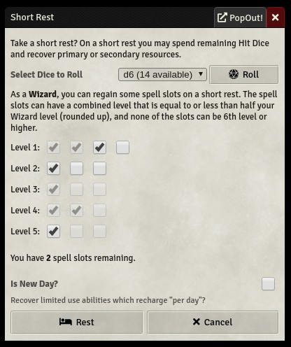
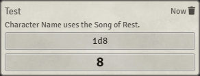
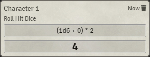
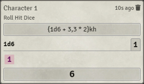
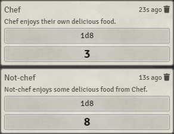
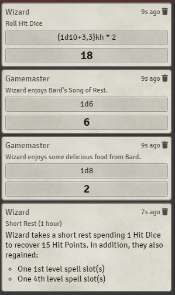

# Short Rest Recovery
This module adds support for the various short rest mechanics in D&D 5E, such as recharging spell slots for Druids and Wizards, Song of Rest from Bards, and bonuses from various feats and items.

## Installation
Use this manifest URL to install the module:

For >0.8.6:
`https://github.com/Haxxer/FoundryVTT-ShortRestRecovery/releases/latest/download/module.json`

For 0.7.10:
`https://github.com/Haxxer/FoundryVTT-ShortRestRecovery/releases/download/0.3.1/module.json`

**Note:** The 0.7.10 version is no longer supported or maintained, so the documentation below may be inaccurate for that version.

## Compatibility

### [Long Rest Hit Dice Healing](https://github.com/schultzcole/FVTT-Long-Rest-HD-Healing-5e)

Short Rest Recovery is compatible with this module. Short rest mechanics remain in place, but rolling hit dice during a long rest will take the Durable feat and Periapt of Wound Closure into account.

## Module Settings
### Quick-roll Hit Dice
If this setting is enabled, it will make it so that when you press the "Roll" button on the short rest UI, no hit dice dialog will be prompted, and the hit die will be rolled immediately.

**Note**: This also affects long rests if you have the *Long Rest Hit Dice Healing* module installed.

### Skip inactive player characters
If this is enabled, any character whose owner is not logged into the game is ignored when considering whether other characters can benefit from their Song of Rest or Chef feat.

## Mechanics

### Feature: [Arcane Recovery](https://www.dndbeyond.com/classes/wizard#ArcaneRecovery-411) (Wizards), [Natural Recovery](https://www.dndbeyond.com/classes/druid#CircleoftheLand) (Druids)

This module adds support for Wizards' Arcane Recovery and Land Druids' Natural Recovery within the short rest dialog.

If the Arcane/Natural Recovery Feature does not have any uses remaining or if there are no spell slots to recover, the spell slot UI shown in the above image will be hidden.

### [Feature: Song of Rest](https://www.dndbeyond.com/classes/bard#SongofRest-80)

If there's a character that is assigned to a player with levels in the Bard class and someone rolls hit dice, the module will automatically roll the appropriate dice based on the bard's level.

### [Item: Periapt of Wound Closure](https://www.dndbeyond.com/magic-items/periapt-of-wound-closure)

If a character is **attuned** to this item (important to be attuned), whenever they roll hit dice the hit points regained is doubled.

### [Feat: Durable](https://www.dndbeyond.com/feats/durable)

If a character has the Durable feat, the minimum they can roll with hit dice is equal to twice their constitution modifier (works with the Periapt of Wound Closure).

### [Feat: Chef](https://www.dndbeyond.com/feats/chef)

If a character that is assigned to a player possesses the Chef feat as well as Chef's Utensils, each character in the party will roll an additional 1d8 as a part of the short rest.

### All together now!

This is a Wizard with the Durable feat, Periapt of Wound Closure, and Arcane Recovery, in a party with a Bard with Song of Rest and the Chef feat.

