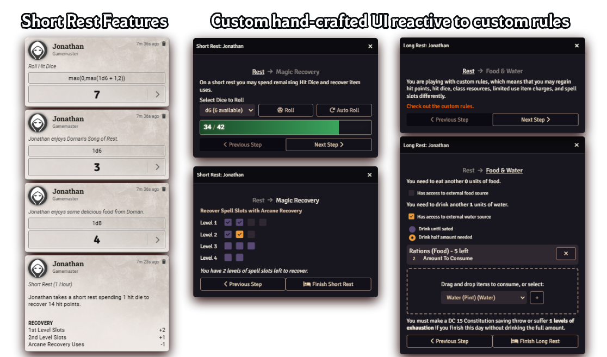

# Rest Recovery 5e

   

---

A module made by [Fantasy Computerworks](http://fantasycomputer.works/).

Other works by us:

- [Fantasy Calendar](https://app.fantasy-calendar.com) - The best calendar creator and management app on the internet
- [Sequencer](https://foundryvtt.com/packages/sequencer) - Wow your players by playing visual effects on the canvas
- [Tagger](https://foundryvtt.com/packages/tagger) - Tag objects in the scene and retrieve them with a powerful API
- [Token Ease](https://foundryvtt.com/packages/token-ease) - Make your tokens _feel good_ to move around on the board
- [Item Piles](https://foundryvtt.com/packages/item-piles) - Drag & drop items into the scene to drop item piles that you can then easily pick up

Like what we've done? Buy us a coffee!

---

# What is Rest Recovery?

This module aims to add support for the various rest mechanics in D&D 5e. This module adds support for alternative rules such as Long Rest Hit Dice Healing along with various modifiers (all optional), as well as most short rest mechanics, such as recharging spell slots for Druids and Wizards, Song of Rest from Bards, and bonuses from various feats and items.

# Installation
Use this manifest URL to install the module:

`https://github.com/fantasycalendar/FoundryVTT-RestRecovery/releases/latest/download/module.json`

# Changelog

You can find the [changelog here](changelog.md).

# Mechanics

## Long Rest Mechanics

By default, the long rest mechanics are set to the 5e defaults. However, in the module settings, you can configure a number of settings that was inspired and taken from the [Long Rest Hit Die Healing for 5e](https://github.com/a-ws-m/FVTT-Long-Rest-HD-Healing-5e) module.

## Short Rest Mechanics

### Feature: [Arcane Recovery](https://www.dndbeyond.com/classes/wizard#ArcaneRecovery-411) (Wizards), [Natural Recovery](https://www.dndbeyond.com/classes/druid#CircleoftheLand) (Druids)

This module adds support for Wizards' Arcane Recovery and Land Druids' Natural Recovery within the short rest dialog.

If the Arcane/Natural Recovery Feature does not have any uses remaining or if there are no spell slots to recover, the spell slot UI will be hidden.

### Feature: [Song of Rest](https://www.dndbeyond.com/classes/bard#SongofRest-80)

If there's a character that is assigned to a player with levels in the Bard class and someone rolls hit dice, the module will automatically roll the appropriate dice based on the bard's level.

### Feat: [Durable](https://www.dndbeyond.com/feats/durable)

If a character has the Durable feat, the minimum they can roll with hit dice is equal to twice their constitution modifier (works with the Periapt of Wound Closure).

### Feat: [Chef](https://www.dndbeyond.com/feats/chef)

If a character that is assigned to a player possesses the Chef feat as well as Chef's Utensils, each character in the party will roll an additional 1d8 as a part of the short rest.

### Feature: [Black Blood Healing](https://www.dndbeyond.com/sources/ai/player-options#VerdanTraits)

If a character has the lineage feature of a Verdan's Black Blood Healing, any hit dice with a 1 or 2 on the hit die roll will be automatically rerolled.

### Item: [Periapt of Wound Closure](https://www.dndbeyond.com/magic-items/periapt-of-wound-closure)

If a character is **attuned** to this item, any hit die rolled is doubled. According to RAW, this doubling happens _before_ the constitution modifier is added to the hit die roll.

### Feature: [Blessing of Wound Closure](https://www.dndbeyond.com/sources/dmg/other-rewards#BlessingOfWoundClosure)

Similar to above, but as a feature.

# Contributing

In order to contribute to this module, you will need to run `npm install` and then `npm run build-watch` in order to build the module's `./dist` folders.
