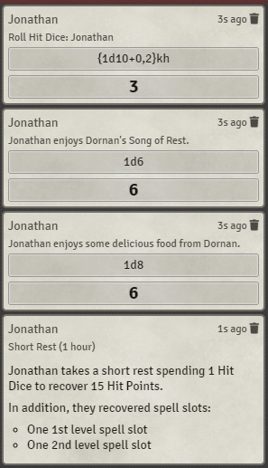

# Rest Recovery
This module mains to add support for the various rest mechanics in D&D 5e. This module adds support for alternative rules such as Long Rest Hit Dice Healing along with various modifiers (all optional), as well as most short rest mechanics, such as recharging spell slots for Druids and Wizards, Song of Rest from Bards, and bonuses from various feats and items.

## Installation
Use this manifest URL to install the module:

`https://github.com/fantasycalendar/FoundryVTT-RestRecovery/releases/latest/download/module.json`

## Mechanics

### Feature: [Arcane Recovery](https://www.dndbeyond.com/classes/wizard#ArcaneRecovery-411) (Wizards), [Natural Recovery](https://www.dndbeyond.com/classes/druid#CircleoftheLand) (Druids)

This module adds support for Wizards' Arcane Recovery and Land Druids' Natural Recovery within the short rest dialog.

If the Arcane/Natural Recovery Feature does not have any uses remaining or if there are no spell slots to recover, the spell slot UI will be hidden.

### [Feature: Song of Rest](https://www.dndbeyond.com/classes/bard#SongofRest-80)

If there's a character that is assigned to a player with levels in the Bard class and someone rolls hit dice, the module will automatically roll the appropriate dice based on the bard's level.

### [Item: Periapt of Wound Closure](https://www.dndbeyond.com/magic-items/periapt-of-wound-closure)

If a character is **attuned** to this item (important to be attuned), whenever they roll hit dice the hit points regained is doubled.

### [Feat: Durable](https://www.dndbeyond.com/feats/durable)

If a character has the Durable feat, the minimum they can roll with hit dice is equal to twice their constitution modifier (works with the Periapt of Wound Closure).

### [Feat: Chef](https://www.dndbeyond.com/feats/chef)

If a character that is assigned to a player possesses the Chef feat as well as Chef's Utensils, each character in the party will roll an additional 1d8 as a part of the short rest.