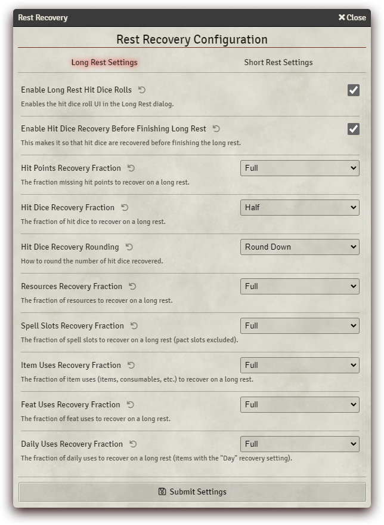

# Rest Recovery 5e

   

---

A module made by [Fantasy Computerworks](http://fantasycomputer.works/).

Other works by us:

- [Fantasy Calendar](https://app.fantasy-calendar.com) - The best calendar creator and management app on the internet
- [Sequencer](https://foundryvtt.com/packages/sequencer) - Wow your players by playing visual effects on the canvas
- [Tagger](https://foundryvtt.com/packages/tagger) - Tag objects in the scene and retrieve them with a powerful API
- [Token Ease](https://foundryvtt.com/packages/token-ease) - Make your tokens _feel good_ to move around on the board
- [Item Piles](https://foundryvtt.com/packages/item-piles) - Drag & drop items into the scene to drop item piles that you can then easily pick up

Like what we've done? Buy us a coffee!

---

# What is Rest Recovery?

This module is a wholesale package that covers any and all mechanics relating to long and short rests, including (but not limited to);

* Class features, such as regaining spell slots through the Wizard's Arcane Recovery and automatic handling of Bard's Song of Rest
* HP Regaining through the Chef feat, and handling of the Tough feat and magic items such as the Periapt of Wound Closure
* Fully featured long rest settings with a multitude of **completely optional** features:
  * Rolling hit dice instead of regaining hit points
  * Partial recovery of spell slots, class features, and/or resources
  * Exhaustion automation
  * Food & water handling, tracking the sated status and starvation over time

The module continues to grow, and will expand further and further.

# Installation
Use this manifest URL to install the module:

`https://github.com/fantasycalendar/FoundryVTT-RestRecovery/releases/latest/download/module.json`

# Full list of features & documentation:

## You can read more about the module on the [wiki](https://github.com/fantasycalendar/FoundryVTT-RestRecovery/wiki).

# Changelog

You can find the [changelog here](changelog.md).

# Contributing

In order to contribute to this module, you will need to run `npm install` and then `npm run build-watch` in order to build the module's `./dist` folders.
